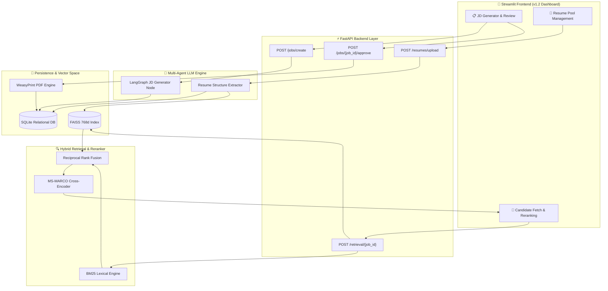

# 🎯 Agentic Hiring Workflow v1.2 🚀🤖💼

[](https://fastapi.tiangolo.com/)
[](https://streamlit.io/)
[](https://www.langchain.com/)
[](https://github.com/facebookresearch/faiss)
[](https://www.python.org/)

An end-to-end, production-grade **Agentic AI Technical Hiring Workflow**. Built with **FastAPI**, **LangGraph / LangChain**, **FAISS Dense Vector Store**, **BM25 Lexical Retrieval**, **Cross-Encoder Re-ranking**, and an ultra-modern **Streamlit UI**. 

This system automates the entire recruiting lifecycle—from AI-driven Job Description (JD) generation and PDF compilation to structured resume parsing, hybrid candidate retrieval, and 2-stage cross-encoder candidate ranking.

---

## 🌟 Key Highlights & Innovations

* **🤖 Agentic Job Description Generator**: Creates tailored, structured JDs from high-level recruiter prompts using LLMs. Features an interactive review workspace with PDF export and human-in-the-loop revision loops.
* **📄 Multi-Format Resume Ingestion**: Parses candidate resumes (`PDF`, `DOCX`, `TXT`) into structured JSON profiles (skills, experience, contact, education, summary) via LLM parsing chains.
* **🧩 Section-Level Resume Chunking**: Automatically breaks parsed resumes into logical section chunks (Summary, Technical & Soft Skills, Work Experience entries, Project entries, Education, Certifications) to generate fine-grained 768-dim embeddings using `BAAI/bge-base-en-v1.5`, preventing token truncation and context dilution.
* **🔍 Hybrid Search Engine (BM25 + Dense FAISS Chunks)**:
  * **BM25 Lexical Search**: Keyword precision across tech stack and candidate text.
  * **768-dim Dense Chunk Vectors**: Section-level semantic embedding with **MaxSim (Maximum Chunk Similarity)** score aggregation per candidate.
* **⚡ Reciprocal Rank Fusion (RRF)**: Merges sparse BM25 ranks and dense FAISS chunk vectors into a unified candidate pool.
* **🏆 Cross-Encoder Re-Ranking**: Employs `cross-encoder/ms-marco-MiniLM-L-6-v2` for deep query-document cross-attention score optimization.
* **🔄 Re-Indexing Utility**: Includes a built-in CLI tool (`python -m scripts.reindex_resumes`) to batch re-index existing database candidate profiles into section chunk vectors.
* **🎨 State-of-the-Art Streamlit UI**: Multi-file batch resume uploader with real-time progress indicators, glassmorphism cards, micro-animations, and high-contrast color palettes (`#0525bb`, `#0b1c30`, `#ffffff`).

---

## 🏗️ System Architecture & Workflow



---

## 🚀 Module Deep Dive

### Module 1: Job Description Generator & Approval Workspace
- **LLM Prompting & Schema**: Generates job summaries, key responsibilities, required/preferred technical skills, and step-by-step interview processes structured via Pydantic models.
- **PDF Compilation**: Uses HTML/CSS Jinja templates rendered into print-ready PDF documents using WeasyPrint.
- **Feedback & Rejection Loop**: Recruiters can provide explicit feedback notes (e.g. *"Focus more on Kubernetes and DevOps"*), triggering the LLM agent to revise and regenerate the JD while tracking revision history.

### Module 2: Resume Ingestion & Section-Level Vector Chunking
- **Multi-File Extraction**: Supports batch `.pdf`, `.docx`, and `.txt` uploads with real-time UI progress bars. Extracts raw text via `PyPDF` and `python-docx`.
- **Structured LLM Parser**: Converts unstructured resume text into a strict JSON schema containing candidate name, contact info, professional summary, technical skills list, work experience, and project highlights.
- **Section-Level Chunking & Embedding**: Embeds discrete candidate sections (Summary, Skills, individual Experience entries, Project entries, Education, Certifications) as separate 768-dimensional vectors using `BAAI/bge-base-en-v1.5`.
- **Atomic Deletion**: Deleting a candidate purges SQLite records and removes all corresponding section chunk vectors from FAISS to maintain index integrity.

### Module 3: Hybrid Retrieval & Cross-Encoder Re-Ranking
- **Step 1 — BM25 Sparse Search**: Tokenizes the approved JD requirements and computes BM25 relevance scores over the candidate pool.
- **Step 2 — FAISS Dense Chunk Vector Search (MaxSim)**: Computes similarity between JD embeddings and candidate section chunk vectors in FAISS, aggregating candidate scores using **MaxSim (Maximum Chunk Similarity)**.
- **Step 3 — Reciprocal Rank Fusion (RRF)**: Combines sparse and dense ranks using the standard RRF formula:
  $$RRF(c) = \sum_{m \in M} \frac{1}{k + r_m(c)}$$
- **Step 4 — Cross-Encoder Re-Ranking**: Passes candidate text pairs through `cross-encoder/ms-marco-MiniLM-L-6-v2` to obtain deep semantic alignment scores, ensuring high-precision top-$K$ candidate rankings.

---

## 💻 Tech Stack

| Component             | Technology / Library                               | Purpose                                                          |
| :-------------------- | :------------------------------------------------- | :--------------------------------------------------------------- |
| **Backend Core**      | FastAPI, Uvicorn, Pydantic v2                      | High-performance async REST API framework & schema validation    |
| **LLM Orchestration** | LangGraph, LangChain, OpenRouter API               | Agentic stateful graph workflows & LLM prompt execution          |
| **Vector Indexing**   | FAISS (`faiss-cpu`), NumPy                         | Fast dense vector similarity search across 768 dimensions        |
| **Dense Embeddings**  | `BAAI/bge-base-en-v1.5`                            | Dense vector embedding model for deep conceptual semantics       |
| **Lexical Search**    | `rank-bm25`                                        | Sparse keyword search engine for exact technical skill matching  |
| **Cross-Encoder**     | `sentence-transformers` (`ms-marco-MiniLM-L-6-v2`) | Deep query-document cross-attention re-ranking                   |
| **PDF Generation**    | WeasyPrint, Jinja2                                 | HTML/CSS to PDF compilation for job description exports          |
| **Relational DB**     | SQLite, SQLAlchemy                                 | Relational persistence for jobs, resumes, and candidate profiles |
| **Frontend UI**       | Streamlit, Custom HTML5/CSS3, Material Symbols     | Reactive web application dashboard with modern UI aesthetics     |

---

## ⚙️ Installation & Setup

### Prerequisites
- **Python 3.10+** installed
- **Git** installed
- **OpenRouter API Key** (or OpenAI / Anthropic API keys)

### 1. Clone the Repository
```bash
git clone https://github.com/saket0x07/Agentic-Hiring-Workflow.git
cd Agentic-Hiring-Workflow
```

### 2. Environment Configuration
Create a `.env` file in the root directory:
```bash
cp .env.example .env
```
Populate `.env` with your API credentials:
```env
OPENROUTER_API_KEY=your_openrouter_api_key_here
MODEL_NAME=openai/gpt-4o-mini
DEFAULT_LLM_MODEL=openai/gpt-4o-mini
TEMPERATURE=0.2

# Database & Vector Store Paths
DATABASE_URL=sqlite:///./database/hiring.db
FAISS_INDEX_PATH=./data/vector_store/resume.index
FAISS_MAPPING_PATH=./data/vector_store/resume_mapping.json
```

### 3. Virtual Environment & Dependencies
```bash
python -m venv .venv
source .venv/bin/activate  # On Windows: .venv\Scripts\activate

pip install --upgrade pip
pip install -r requirements.txt
```

---

## 🚀 Running the Application

### Step 1: Launch FastAPI Backend Server
```bash
uvicorn app.api.main:app --reload --host 127.0.0.1 --port 8000
```
- API Documentation (Swagger UI): `http://127.0.0.1:8000/docs`
- Health Check: `http://127.0.0.1:8000/health`

### Step 2: Launch Streamlit Dashboard
Open a new terminal tab and run:
```bash
streamlit run streamlit_app.py
```
Open your browser at `http://localhost:8501`.

---

## 🔄 Re-Indexing Existing Resumes

If you update embedding models or need to re-generate section chunk vectors for candidates already stored in SQLite (`hiring.db`), run the automated CLI re-indexing tool:

```bash
python -m scripts.reindex_resumes
```
This script automatically clears the existing FAISS index, reads candidate profiles from SQLite, generates fresh 768-dim section chunk vectors, and updates `resume_mapping.json`.

---

## 📡 API Endpoint Reference

| Method | Endpoint                 | Description                                                   |
| :----- | :----------------------- | :------------------------------------------------------------ |
| `GET`  | `/health`                | Server health check and active environment status             |
| `GET`  | `/jobs/`                 | Retrieve all hiring requests and job descriptions             |
| `POST` | `/jobs/create`           | Trigger AI agent to generate a new Job Description            |
| `GET`  | `/jobs/{job_id}`         | Retrieve specific job details and current state               |
| `POST` | `/jobs/{job_id}/approve` | Approve JD and build exportable PDF document                  |
| `POST` | `/jobs/{job_id}/reject`  | Submit revision feedback notes and regenerate JD              |
| `POST` | `/resumes/upload`        | Upload resume (`.pdf`, `.docx`, `.txt`), parse & index vector |
| `GET`  | `/resumes/`              | Retrieve list of all candidate resumes in candidate pool      |
| `POST` | `/retrieval/{job_id}`    | Execute Hybrid Retrieval (BM25 + FAISS + RRF + Cross-Encoder) |

---

## 📂 Project Structure

```text
Agentic-Hiring-Workflow/
├── app/
│   ├── agents/               # LangGraph Agentic Nodes (JD Generator, Resume Parser)
│   ├── api/
│   │   ├── routes/           # FastAPI Routers (jobs, resumes, retrieval)
│   │   └── main.py           # FastAPI Application Entrypoint
│   ├── core/
│   │   ├── config.py         # App Settings & Environment variables
│   │   └── logger.py         # Loguru logger setup
│   ├── graph/                # LangGraph State & Execution Nodes
│   ├── prompts/              # LLM System Prompts (JD generation, resume parsing)
│   ├── schemas/              # Pydantic Schemas & Data Transfer Objects
│   ├── services/             # Core Services (PDF, Database, Embedding, Reranker, VectorStore)
│   └── templates/            # HTML/CSS Jinja Templates for PDF Export
├── data/
│   ├── resumes/              # Stored resume raw files
│   └── vector_store/         # FAISS Index & mapping JSON files
├── database/                 # SQLite database file (hiring.db)
├── scripts/
│   └── reindex_resumes.py    # CLI script for re-indexing database resumes into section chunk vectors
├── streamlit_app.py          # Modern Streamlit Dashboard App
├── requirements.txt          # Python dependencies
├── .env.example              # Environment variables template
└── README.md                 # Project Documentation
```

---

## 🧪 Testing & Verification

Run tests using `pytest`:
```bash
pytest -v
```

Verify Python syntax and imports across backend and frontend:
```bash
python -m py_compile streamlit_app.py app/api/main.py
```

---

## Author & Acknowledgments

Developed with ❤️ by **[saket0x07](https://github.com/saket0x07)** for advanced agentic AI recruitment workflows.
